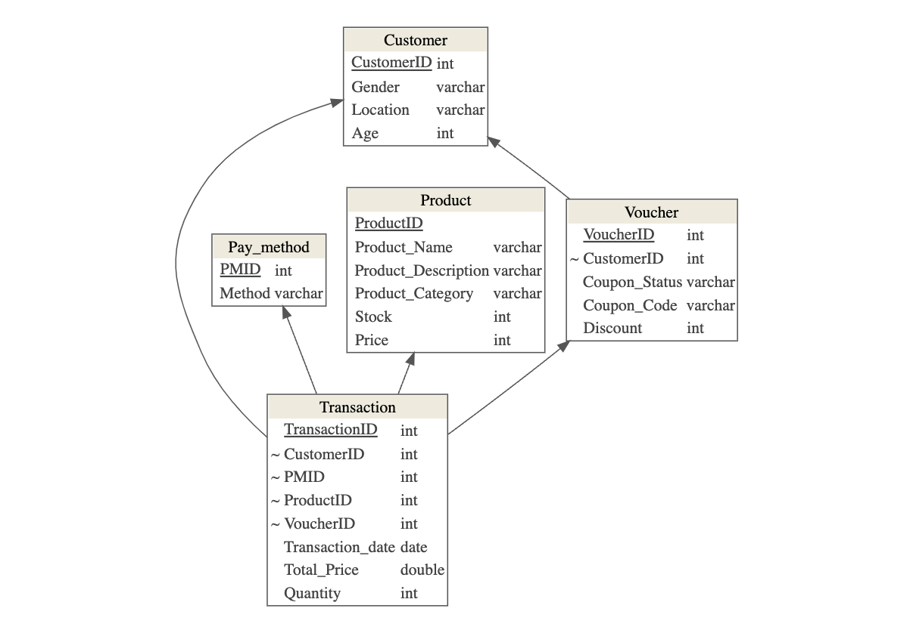
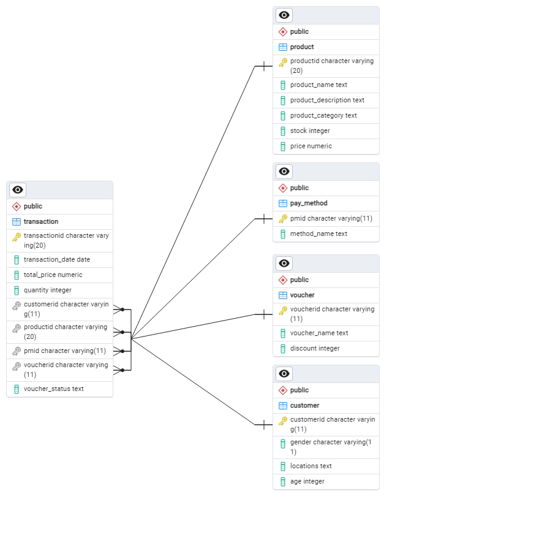

<p align="center">
  
</p>

<div align="center">


# SIGMARIA MARKET
# _"Big Choices, Big Deals"_
</div>

## :bookmark_tabs: Menu

- [Information](#scroll-tentang)
- [About](#blue_book-tentang)
- [Screenshot](#rice_scene-screenshot)
- [Demo](#dvd-demo)
- [Requirements](#exclamation-requirements)
- [Database Scheme](#floppy_disk-skema-database)
- [ERD](#rotating_light-erd)
- [Data Description](#heavy_check_mark-deskripsi-data)
- [Folder Structure](#open_file_folder-struktur-folder)
- [Our Team](#smiley_cat-tim-pengembang)

## :pushpin: Information
HELLO... THE LOVELY OUR USERS!! :heartpulse:
WELCOME TO THE SIGMARIA MARKET! :wave:

Here's a information about sigmaria :

## What is Sigmaria?
Sigmaria Market is a platform that provides comprehensive information about sales transactions, available products, payment methods, vouchers, and customer data. This platform enables users to browse and acquire various products available in Sigmaria Market. With a wide range of products and recorded transaction information, Sigmaria Market presents up-to-date information about market activities that can assist users in making desired purchases. Additionally, the platform also offers recommendations for products that are suitable for customers.

## How to use this Platform?
Navigate through the menu at the top of the page to explore the available products and vouchers. Choose your desired category or use the search feature to find specific items. Sigmaria Market will then display detailed information about the products, including vouchers and available payment methods. Simply add your chosen items to the cart and proceed to checkout. Enjoy the convenience of shopping with Sigmaria!

## :clipboard: About

The final project of the Statistical Data Management course takes the topic of the Sigmaria Market Online Shop Database. The specifies project analysis of sales patterns of various products, transactions, vouchers and payment methods provided by the online shop. The dataset used in this project was sourced from Kaggle. The expected result is a database management platform in the form of a web application that can make it easier for users to improve and optimize analysis sales strategies. Users can search for data based on the desired category, e.g searching of various products, vouchers etc.

## :rice_scene: Screenshot
- Home
<p align="center">
  
</p>

- Product
  <p align="center">
  
</p>

- Transactions
<p align="center">
  
</p>

- Voucher
<p align="center">
  
</p>
  
- Payment Methods
<p align="center">
  
</p>


## :dvd: Demo

The link of our shinnyapps or dashboard project : https://yudheeet1991.shinyapps.io/mdskel4app/#


## :exclamation: Requirements

- Data Scrapping used by package R `rvest` and other package e.g `tidyverse`,`rio`,`kableExtra` dan `stingr`  
- The RDBMS are PostgreSQL and ElephantSQL
- The Dashboard are `shinny`, `shinnythemes`, `bs4Dash`, `DT`, dan `dplyr` dari package R

## :floppy_disk: Database Scheme 

Structure description of *primary key* **customer**, **voucher**, **pay_method** and **product** also *foreign key* **transaction** in establishing relationships between tables or entities.

<p align="center">
  
</p>

## :rotating_light: ERD

ERD (Entity Relationship Diagram) describes the relationship between entities and attributes. In this project, all attributes of the product, customer, voucher and payment method entities are related to the transaction entity.

<p align="center">
  
</p>

## :heavy_check_mark: Data Description

Contains the tables and SQL DDL (CREATE) syntax.

### :floppy_disk: Create Database
The Sigmaria Market Online Shop database stores information that represents interconnected data attributes for the analysis.

```sql
CREATE DATABASE Online_Shop
    WITH
    OWNER = postgres
    ENCODING = 'UTF8'
    CONNECTION LIMIT = -1
    IS_TEMPLATE = False;
```
### :womans_clothes: Create Table Product
The product table provides information to users about products of the sigmaria market. Users can find out the product ID, product name, product description, product category, stock amount, and price of each product. Below is a description for each author's table.

| Attribute                  | Type                  | Description                     		       |
|:---------------------------|:----------------------|:------------------------------------------------|
| productid                  | character varying(20) | Id Produk                       		       |
| product_name               | text		     | Nama Produk                   		       |
| product_description        | text		     | Deskripsi Produk                      	       |	
| product_category           | text		     | Kategori Produk                 		       |
| stock	                     | integer		     | Jumlah Stok dari Setiap Produk	               |
| price		    	     | numeric               | Harga dari Masing-Masing Produk                 |

with the SQL script :

```sql
CREATE TABLE IF NOT EXISTS public.Product (
    ProductID character varying(20) NOT NULL,
    Product_name text NOT NULL,
    Product_Description text NOT NULL,
	Product_Category text NOT NULL,
	Stock integer NOT NULL,
	Price numeric NOT NULL,
    PRIMARY KEY (ProductID)
);
```
### :computer: Create Table Transaction
The transaction table presents information of transactions. Users can find out transaction ID, transaction date, total price of each transaction, quantity, customer ID, product ID, pay method ID, voucher ID, voucher status. The following is a description for each transaction table.

| Attribute                  | Type                  | Description                     		       |
|:---------------------------|:----------------------|:------------------------------------------------|
| transactionid              | character varying(20) | Id Transaksi                       	       |
| transaction_date           | date		     | Tanggal Transaksi                  	       |
| total_price                | numeric		     | Total Harga dari Tiap Transaksi                 |	
| quantity                   | integer		     | Jumlah Produk	                	       |
| customerid                 | character varying(11) | Id Customer                                     |
| productid    	    	     | character varying(20) | Id Produk	                               |
| pmid	                     | character varying(11) | Id Pay Method     			       |
| voucherid		     | character varying(11) | Id Voucher				       |
| voucher_status             | text		     | Status Voucher                   	       |

with the SQL script :
```sql
CREATE TABLE IF NOT EXISTS public.Voucher (
    VoucherID character varying(11) NOT NULL,
    Voucher_name text NOT NULL,
    Voucher_status text NOT NULL,
	Discount integer NOT NULL,
	CustomerID character varying(11) NOT NULL,
	PRIMARY KEY (VoucherID),
	FOREIGN KEY (CustomerID) REFERENCES Customer (CustomerID)
);
```
### :ticket: Create Table Voucher
The voucher table presents information about a voucher. Besides being able to know the number of products, users will also get information about available vouchers. Users will get the voucher information about the name of the voucher and the amount of the discount on the voucher. Here is a description of the voucher table.

| Attribute                  | Type                  | Description                     		       |
|:---------------------------|:----------------------|:------------------------------------------------|
| voucherid                  | character varying(11) | Id Voucher                       	       |
| voucher_name               | text		     | Nama Voucher                  		       |
| discount                   | integer		     | Besaran Diskon dari Setiap Voucher              |	

with the SQL script :

```sql
CREATE TABLE IF NOT EXISTS public.Voucher (
    VoucherID character varying(11) NOT NULL,
    Voucher_name text NOT NULL,
    Voucher_status text NOT NULL,
	Discount integer NOT NULL,
	CustomerID character varying(11) NOT NULL,
	PRIMARY KEY (VoucherID),
	FOREIGN KEY (CustomerID) REFERENCES Customer (CustomerID)
);
```
### :credit_card: Create Table Pay_Method
The pay_method table provides information to the users about payment methods which consist of 4 methods, there are card, PayPal, digital wallets and others from PMID and the method name of each ID. Here's a description for each pay_method table.

| Attribute          | Type                  | Description                     |
|:-------------------|:----------------------|:--------------------------------|
| pmid               | character varying(11) | Id pay method                   |
| method_name        | text		     | nama metode pembayaran	       |

with the SQL script :

```sql
CREATE TABLE IF NOT EXISTS public.Pay_method (
    PMID character varying(11) NOT NULL,
    Method_name text NOT NULL,
    Voucher_status text NOT NULL,
	Discount integer NOT NULL,
	CustomerID character varying(11) NOT NULL,
	PRIMARY KEY (PMID),
	FOREIGN KEY (CustomerID) REFERENCES Customer (CustomerID)
);
```
### :couple: Create Table Customer
The customer table provides information to the user regarding customer data, so that the user can find out the customer ID, gender, location which includes 4 locations, there are California, New York, Chicago, New Jersey and age range 17 - 63 years. Here is a description for each customer table. 

| Attribute          | Type                  | Description                     |
|:-------------------|:----------------------|:--------------------------------|
| customerid         | character varying(11) | Id Customer                     |
| gender             | character varying(11) | Jenis Kelamin                   |
| locations          | text		     | Lokasi                          |
| age		     | integer	 	     | Umur	                       |

with the SQL script : 

```sql
CREATE TABLE IF NOT EXISTS public.Customer (
    CustomerID character varying(11) NOT NULL,
    Gender character varying(11) NOT NULL,
    Locations text NOT NULL,
	Age integer NOT NULL,
    PRIMARY KEY (CustomerID)
);
```
## :open_file_folder: Folder Structure

```
.
├── Image
├── app           # ShinyApps
│   ├── css
│   │   ├── **/*.css
│   ├── server.R
│   └── ui.R
├── con
├── data 
│   ├── csv
│   │   ├── **/*.css
│   └── sql
|       └── db.sql
├── doc           # Doc for the project
├── .DS_Store           
├── .gitignore
├── ProjectMDS.Rproj
└── README.md
```

## :heavy_heart_exclamation: Our Team


- Backend Developer: [Rachmat Bintang Yudhianto](https://github.com/yudheeeeet) (G1501231030)
  <p align="center">
  
</p>

- Database Manager: [Tasya Anisah Rizqi](https://github.com/tasyaanisahrizqi) (G1501231046)
<p align="center">
  
</p>

- Technical Writer: [Yunna Mentari Indah](https://github.com/yunnamentari) (G1501231017)
<p align="center">
  
</p>

- Frontend Developer: [Uswatun Hasanah](https://github.com/hhyuss) (G1501231040)
<p align="center">
  
</p>


