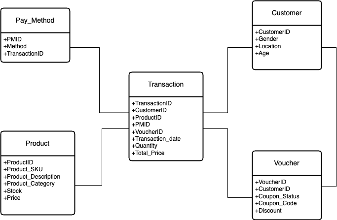

<p align="center">
  
</p>

<div align="center">


# SIGMARIA MARKET
# "Big Choices, Big Deals"
</div>

## :bookmark_tabs: Menu

- [Info](#scroll-tentang)
- [Tentang](#blue_book-tentang)
- [Screenshot](#rice_scene-screenshot)
- [Demo](#dvd-demo)
- [Requirements](#exclamation-requirements)
- [Skema Database](#floppy_disk-skema-database)
- [ERD](#rotating_light-erd)
- [Deskripsi Data](#heavy_check_mark-deskripsi-data)
- [Struktur Folder](#open_file_folder-struktur-folder)
- [Tim Pengembang](#smiley_cat-tim-pengembang)

## :scroll: Info

Sigmaria Market Online Shop adalah sebuah platform yang menyediakan informasi lengkap tentang transaksi penjualan, produk yang tersedia, metode pembayaran yang digunakan, voucher yang tersedia, dan data pelanggan. Platform ini memungkinkan pengguna untuk menjelajahi dan memperoleh berbagai produk yang tersedia di Sigmaria Market. Dengan berbagai macam produk dan informasi tentang transaksi yang tercatat, Sigmaria Market menyajikan informasi terkini mengenai aktivitas pasar yang dapat membantu pengguna dalam melakukan pembelian yang diinginkan. Selain itu, platform ini juga menyediakan rekomendasi product yang sesuai untuk customer.


## :blue_book: Tentang

Project akhir mata kuliah Manajemen Data Statistika mengambil topik tentang Database Sigmaria Market Online Shop. Project ini mengspesifikasikan analisis pola penjualan berbagai produk, customer, transaksi, metode pembayaran dan voucher yang disediakan dalam online shop. Kumpulan data yang digunakan dalam proyek ini bersumber dari Kaggle. Hasil yang diharapkan adalah terbentuknya sebuah platform manajemen database berupa web application yang dapat memudahkan user dalam menganalisis untuk meningkatkan dan mengoptimalkan strategi penjualan. User dapat mencari data berdasarkan kategori yang di inginkan, misalnya pencarian berbagai macam produk, voucher yang disediakan dan lain-lain.

## :rice_scene: Screenshot

<p align="center">
  
</p>

## :dvd: Demo

Berikut merupakan link untuk shinnyapps atau dashboard dari project kami:


## :exclamation: Requirements

- Scrapping data menggunakan package R yaitu `rvest` dengan pendukung package lainnya seperti `tidyverse`,`rio`,`kableExtra` dan `stingr`  
- RDBMS yang digunakan adalah PostgreSQL dan ElephantSQL
- Dashboard menggunakan `shinny`, `shinnythemes`, `bs4Dash`, `DT`, dan `dplyr` dari package R

## :floppy_disk: Skema Database

Menggambarkan struktur *primary key* **customer**, **voucher**, **pay_method** dan **product** dengan *foreign key* **transaction** dalam membangun relasi antara tabel atau entitas.
<p align="center">
  
</p>


## :rotating_light: ERD

ERD (Entity Relationship Diagram) menampilkan hubungan antara entitas dengan atribut. Pada project ini, seluruh atribut pada entitas produk, customer, voucher, dan metode pembayaran berhubungan dengan entitas transaksi.

<p align="center">
  
</p>

## :heavy_check_mark: Deskripsi Data

Berisi tentang tabel-tabel yang digunakan berikut dengan sintaks SQL DDL (CREATE).

### Create Database
Database Sigmaria Market Online Shop menyimpan informasi yang mewakili atribut data yang saling berhubungan untuk kemudian dianalisis.
```sql
CREATE DATABASE Online_Shop
    WITH
    OWNER = postgres
    ENCODING = 'UTF8'
    CONNECTION LIMIT = -1
    IS_TEMPLATE = False;
```
### Create Table Customer
Table customer memberikan informasi kepada user mengenai data customer, sehingga user dapat mengetahui id customer, gender, lokasi yang mencakup 4 lokasi yaitu california, new york, chicago, new jersey dan umur dengan rentang 17 - 63 tahun. Berikut deskripsi untuk setiap tabel customer.
| Attribute          | Type                  | Description                     |
|:-------------------|:----------------------|:--------------------------------|
| customerid         | character varying(11) | Id Customer                     |
| gender             | character varying(11) | Jenis Kelamin                   |
| locations          | text		     | Lokasi                          |
| age		     | integer	 	     | Umur	                       |

dengan script SQL sebagai berikut:
```sql
CREATE TABLE IF NOT EXISTS public.Customer (
    CustomerID character varying(11) NOT NULL,
    Gender character varying(11) NOT NULL,
    Locations text NOT NULL,
	Age integer NOT NULL,
    PRIMARY KEY (CustomerID)
);
```
### Create Table Pay_Method
Table pay_method memberikan informasi kepada user untuk mengetahui terkait metode pembayaran yang terdiri dari 4 metode yaitu card, paypal, digital wallets dan lainnya melalui pmid dan nama metode dari masing-masing id. Berikut deskripsi untuk setiap tabel pay_method.
| Attribute          | Type                  | Description                     |
|:-------------------|:----------------------|:--------------------------------|
| pmid               | character varying(11) | Id pay method                   |
| method_name        | text		     | nama metode pembayaran	       |

dengan script SQL sebagai berikut:
```sql
CREATE TABLE IF NOT EXISTS public.Pay_method (
    PMID character varying(11) NOT NULL,
    Method_name text NOT NULL,
    Voucher_status text NOT NULL,
	Discount integer NOT NULL,
	CustomerID character varying(11) NOT NULL,
	PRIMARY KEY (PMID),
	FOREIGN KEY (CustomerID) REFERENCES Customer (CustomerID)
);
```
### Create Table Product
Table produk memberikan informasi kepada user mengenai produk pada sigmaria market. User dapat mengetahui id produk, nama produk, deskripsi produk, kategori produk, jumlah stok tiap produk, dan harga dari masing-masing produk. Berikut deskripsi untuk setiap tabel penulis.
| Attribute                  | Type                  | Description                     		       |
|:---------------------------|:----------------------|:------------------------------------------------|
| productid                  | character varying(20) | Id Produk                       		       |
| product_name               | text		     | Nama Produk                   		       |
| product_description        | text		     | Deskripsi Produk                      	       |	
| product_category           | text		     | Kategori Produk                 		       |
| stock	                     | integer		     | Jumlah Stok dari Setiap Produk	               |
| price		    	     | numeric               | Harga dari Masing-Masing Produk                 |

dengan script SQL sebagai berikut:
```sql
CREATE TABLE IF NOT EXISTS public.Product (
    ProductID character varying(20) NOT NULL,
    Product_name text NOT NULL,
    Product_Description text NOT NULL,
	Product_Category text NOT NULL,
	Stock integer NOT NULL,
	Price numeric NOT NULL,
    PRIMARY KEY (ProductID)
);
```
### Create Table Voucher
Table voucher menyajikan informasi lengkap mengenai sebuah voucher. Selain dapat mengetahui jumlah produk, user juga akan mendapatkan informasi mengenai voucher yang tersedia. Informasi voucher yang didapatkan berupa nama voucher dan besaran diskon dari voucher tersebut.  Berikut deskripsi dari tabel voucher.
| Attribute                  | Type                  | Description                     		       |
|:---------------------------|:----------------------|:------------------------------------------------|
| voucherid                  | character varying(11) | Id Voucher                       	       |
| voucher_name               | text		     | Nama Voucher                  		       |
| discount                   | integer		     | Besaran Diskon dari Setiap Voucher              |	

dengan script SQL sebagai berikut:              
```sql
CREATE TABLE IF NOT EXISTS public.Voucher (
    VoucherID character varying(11) NOT NULL,
    Voucher_name text NOT NULL,
    Voucher_status text NOT NULL,
	Discount integer NOT NULL,
	CustomerID character varying(11) NOT NULL,
	PRIMARY KEY (VoucherID),
	FOREIGN KEY (CustomerID) REFERENCES Customer (CustomerID)
);

```
### Create Table Transaction
Table transaction menyajikan informasi mengenai transaksi. User dapat mengetahui id transaksi, tanggal transaksi, total harga dari tiap transaksi, quantitiy, id customer, id product, pay method id, voucher id, status voucher.  Berikut deskripsi untuk setiap tabel transaction.
| Attribute                  | Type                  | Description                     		       |
|:---------------------------|:----------------------|:------------------------------------------------|
| transactionid              | character varying(20) | Id Transaksi                       	       |
| transaction_date           | date		     | Tanggal Transaksi                  	       |
| total_price                | numeric		     | Total Harga dari Tiap Transaksi                 |	
| quantity                   | integer		     | Jumlah Produk	                	       |
| customerid                 | character varying(11) | Id Customer                                     |
| productid    	    	     | character varying(20) | Id Produk	                               |
| pmid	                     | character varying(11) | Id Pay Method     			       |
| voucherid		     | character varying(11) | Id Voucher				       |
| voucher_status             | text		     | Status Voucher                   	       |

dengan script SQL sebagai berikut:
```sql
CREATE TABLE IF NOT EXISTS public.Voucher (
    VoucherID character varying(11) NOT NULL,
    Voucher_name text NOT NULL,
    Voucher_status text NOT NULL,
	Discount integer NOT NULL,
	CustomerID character varying(11) NOT NULL,
	PRIMARY KEY (VoucherID),
	FOREIGN KEY (CustomerID) REFERENCES Customer (CustomerID)
);
```
## :open_file_folder: Struktur Folder

```
.
├── Image
├── app           # ShinyApps
│   ├── css
│   │   ├── **/*.css
│   ├── server.R
│   └── ui.R
├── con
├── data 
│   ├── csv
│   │   ├── **/*.css
│   └── sql
|       └── db.sql
├── doc           # Doc for the project
├── src           # Project source code
├── .gitignore
├── LICENSE
└── README.md
```

## :smiley_cat: Tim Pengembang

- Backend Developer: [Rachmat Bintang Yudhianto](https://github.com/yudheeeeet) (G1501231030)
- Database Manager: [Tasya Anisah Rizqi](https://github.com/tasyaanisahrizqi) (G1501231046)
- Technical Writer: [Yunna Mentari Indah](https://github.com/yunnamentari) (G1501231017)
- Frontend Developer: [Uswatun Hasanah](https://github.com/hhyuss) (G1501222040)
